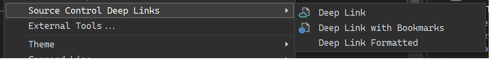
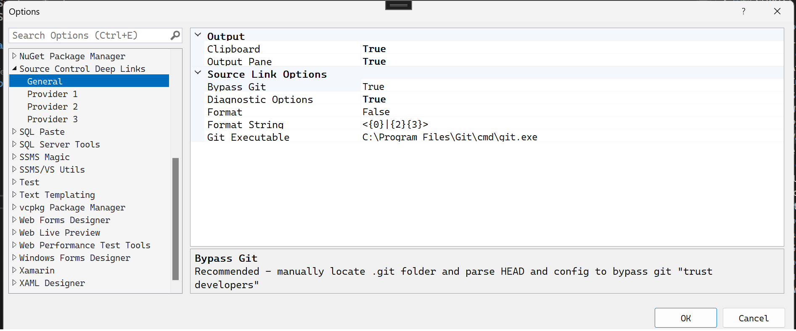
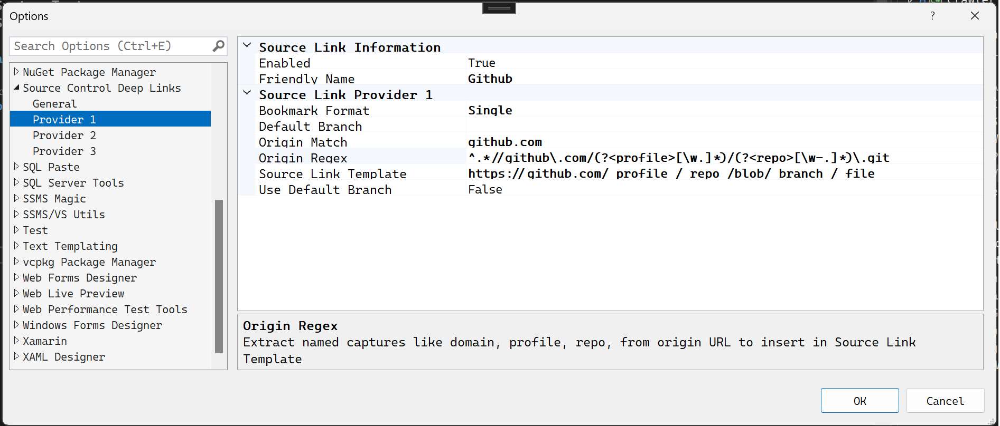
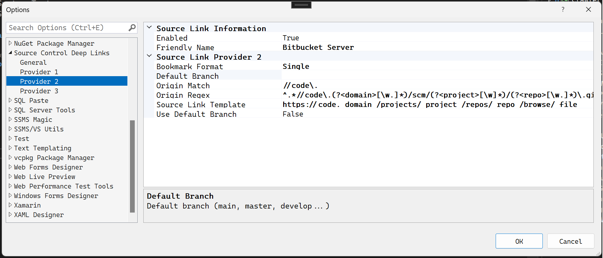

# ssms-vs-extensions
SSMS 18.x and Visual Studio 2019/2022 extensions

# Source Control Deep Links
## Currently Github, Bitbucket Server, many more providers easily supported
Get a deep link to your source control, optionally include bookmarked lines tagged

### Tools, Source Control Deep Links flyout menu

### Tools, Options, Source Control Deep Links, General 

### Tools, Options, Source Control Deep Links, Provider 1
Example configuration for Github

#### How the configuration works
Each GIT repository contains a ".git" folder with a config file.  The extension retrieves the remote origin URL, example:

[remote "origin"]  
	url = https://github.com/jefflomax/ssms-vs-extensions.git

To check if this provider is the one that should be used, the Enabled flag, then the text in "Origin Match" is checked against this origin URL, example:
github.com

In order to form the URL to your online source control, extract whatever values you need from the origin URL, using **named capture groups**.  In this example, the "Origin Regex" is:  
^.\*//github\.com/(?\<**profile**>[\w.]*)/(?\<**repo**>[\w-.]*)\.git  
( In RegEx, ?\<**captureGroupName**> defines the name, profile & repo above )

This captures the two named groups:  
profile = jefflomax  
repo = ssms-vs-extensions

The extension provides two additional values:  
**branch** = the current branch name, e.g. main, develop, etc.  
**file** = the current source file path within the repo

The above items are substituted into the "Source Link Template" which is simply a space delimited URL, in this example:  
https://github.com/ profile / repo /blob/ branch / file

which becomes

https://github.com/jefflomax/ssms-vs-extensions/blob/main/SourceControlDLShared/Commands/BitbucketDeepLinkCommand.cs

### Tools, Options, Source Control Deep Links, Provider 2
Example configuration for Bitbucket Server

# SQL Paste
## CSV and VALUES formatted paste for SSMS 18
Adds Edit, Paste Special, Paste as SQL menu

* Paste as CSV
* Paste as Values

Both support horizontal or vertical direction, optionally quoting integers

# SSMS VS Utils
## Hard Line Down
Allows a cursor down on the last line of a file

# SQLSynSugarAndValidation
The most interesting extension in this repo, SQLSynSugarAndValidation, is committed with the project unloaded, because at the moment access to a private repository is required to access the NuGet packages that make it work.  Stay tuned for this to become public, ping if it interests you.

Visual Studio 2022 support coming soon.

Enjoy,

Jeff
